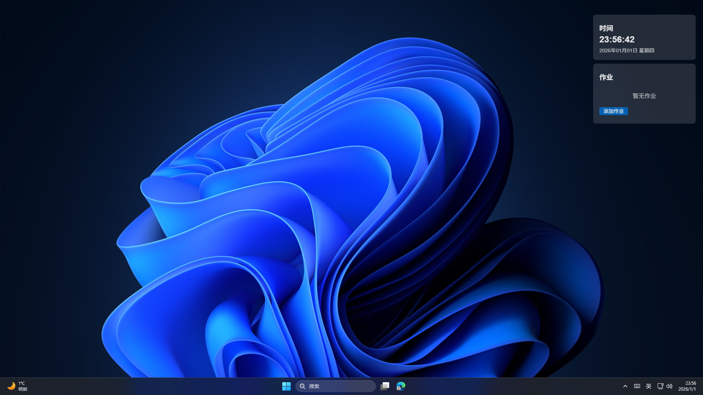

# ClassWindow

## 介绍

课堂窗是一个美丽，精巧的用于班级的桌面悬浮窗，基于Electron构建，用于显示信息等。

## 使用

只需三步：下载软件，解压，然后运行！
**注意：在Linux上使用.deb包安装时，需要在安装完成后执行命令 `sudo chmod 777 /usr/lib/classwindow/*` 以允许 ClassWindow 创建数据文件。**

## 配置

打开托盘菜单，点击设置，开关时钟与作业功能。

## 截图

## 联系我们

QQ群：925490458

## 技术栈

- [Electron](https://www.electronjs.org/)
- [FluentUI](https://developer.microsoft.com/zh-cn/fluentui)
